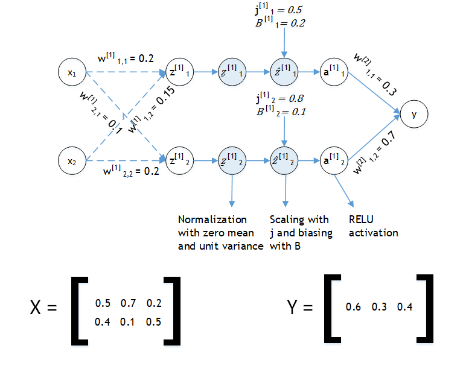

### Submission  

  

<h1 style='text-align: center'> COMSATS University, Islamabad </h1>
<h1 style='text-align: center'> Department of Computer Science </h1>
<h1 style='text-align: center'> CSC483 - Topics in Computer Science II (Programming for Artificial Intelligence) </h1>
<h2 style='text-align: center'> Quiz 03 </h2>
<h2 style='text-align: center'> Submitted by: Waleed Butt SP18-BCS-170 </h2>

## Question
Do the following in python. **Do not use python dependencies related to machine learning including keras, tensorflow or pytorch etc**. This should be implemented using simple matrix multiplication operations for which numpy is enough.  

Imagine a simple batch normalization network shown below. Each layer has a unique specified function and the final scaler output y is a simple linear combination of the preceding neurons. The network has 10 parameters, the initial values of which are already given. Assume sum of squared error as cost function. A set of three examples alongwith the three set of ground truth labels is also given as training set. **Use a simple gradient descent and print out the values of these 10 parameters for three iterations**. Keep learning rate fixed at 0.5 and see if the error goes down or up with each iteration. Notice that input X is not normalized; normalize it with zero mean and unit variance before feeding into the network  

